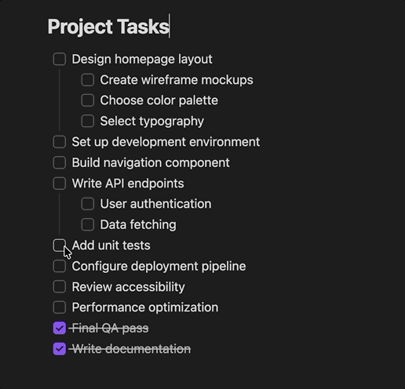

# Auto Sort Checked Items

An [Obsidian](https://obsidian.md) plugin that replicates Apple Notes' "Automatically sort checked items" behavior: when you check off a to-do item, it automatically moves to the bottom of the list so your focus stays on what's left to do.

## Features

- ✅ **Auto-reorder** — Checked items slide to the bottom of their checkbox group
- 🪆 **Nesting-aware** — Items with sub-items move as a group, and indented items reorder within their own level
- ✨ **Smooth animation** — A ghost of the checked row visually slides to its new position
- ↩️ **Clean undo** — Cmd/Ctrl+Z undoes both the check and the move in one step

## Demo



Checked items slide to the bottom with a smooth animation. Nested items move as a group.

## Installation

### Manual

1. Download `main.js` and `manifest.json` from the [latest release](https://github.com/tom-un/obsidian-checkbox-reorder/releases)
2. Create a folder called `checkbox-reorder` in your vault's `.obsidian/plugins/` directory
3. Place both files inside it
4. In Obsidian, go to **Settings → Community Plugins** and enable "Checkbox Reorder"

### From source

```bash
git clone https://github.com/tom-un/obsidian-checkbox-reorder.git
cd obsidian-checkbox-reorder
npm install
npm run build
```

Then copy the folder (or symlink it) into your vault's `.obsidian/plugins/` directory.

## Development

```bash
npm run dev    # Watch mode — rebuilds on file changes
npm run build  # Production build
```

## License

MIT
